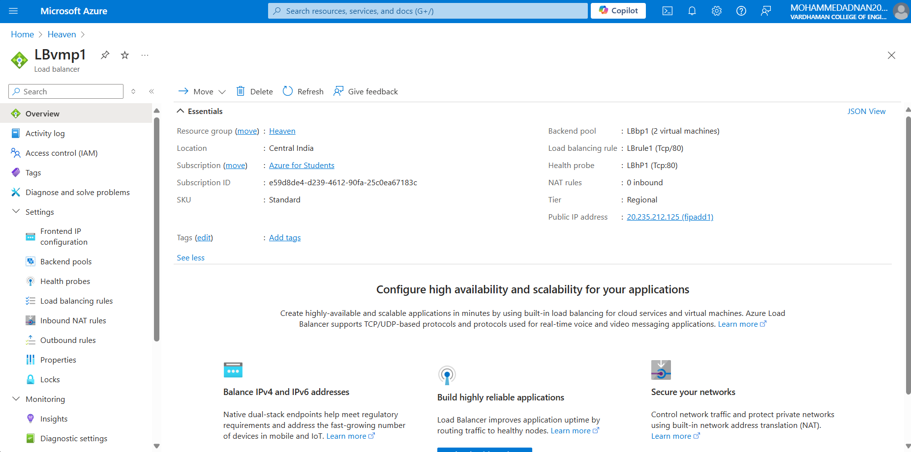

# Azureproject-1
This project focused on creating and deploying a static web page dedicated to the Indian Premier League (IPL) and its teams. The platform provides comprehensive information about IPL teams, fostering a community of dedicated cricket enthusiasts. Join us on this journey to explore the world of IPL and its teams.

# Project Details
1. **Project Demo URL:** /
2. **Demo Video URL:** 
3. **GitHub Repository URL:** (https://github.com/adithyeshwar/Azurep1.git)
4. **Industry:** Sports - Cricket

# Roles and Responsibilities
1. **Adithyeshwar Goud (Project Management, Deployment):** Manages the web development and deployment project, including VNETs, VMs, and load balancer setup.
2. **Kannaiah (Images, Logos, Chatbot, Documentation):** Responsible for sourcing images, creating logos, developing chatbot content, and managing the documentation process to ensure all project details are accurately recorded.

# Azure Services Used:
1. **Virtual Network (VNET) with 2 Subnets:** Provides network segmentation for the project infrastructure.
2. **Availability Set:** Ensures high availability of the virtual machines (VMs) by distributing them across multiple fault and update domains.
3. **Load Balancer:** Distributes incoming web traffic across the VMs to ensure reliability and uptime.
4. **Virtual Machines (VMs):** Hosts the static web page, which was deployed using custom code.
5. **Resource Group:** All resources are organized within a single Resource Group, simplifying management and deployment.

# Problem Statement:
Cricket enthusiasts often struggle to find a centralized platform that provides detailed and up-to-date information about IPL teams. This project addresses this gap by creating a static web page that aggregates team information, player statistics, and historical data, providing easy access for fans.

# Project Description:
The IPL Static Web Page project involves creating a centralized platform for IPL fans to access comprehensive information about their favorite teams. The project was deployed on Microsoft Azure using several core services to ensure scalability, reliability, and security.

The infrastructure includes a Virtual Network (VNET) with two subnets, ensuring network security and proper segmentation. Two Virtual Machines (VMs) were created manually and configured within an Availability Set to ensure high availability. A Load Balancer was set up to distribute traffic between the VMs, providing a seamless experience for users. The static web page was deployed using custom code and is hosted on these VMs, accessible via the Load Balancer.

# Core Azure Services:
1. **Virtual Network (VNET):** Provides a secure network environment with subnets that separate and protect the project resources.
2. **Availability Set:** Ensures that the VMs are resilient to outages by distributing them across multiple fault and update domains.
3. **Load Balancer:** Evenly distributes incoming traffic to the VMs, ensuring high availability and performance.
4. **Virtual Machines (VMs):** The core compute resources where the static web page is hosted.
5. **Resource Group:** Centralizes management and organization of all project resources.

# Screenshots:
- **Virtual machines Configuration**
  
  
  
- **Static Website**
  
  
- **Load Balancer Configuration**
  

# Final Project Statement:
The IPL Static Web Page project successfully created a reliable and accessible platform for cricket fans to explore detailed information about IPL teams. Utilizing Azure services, the project achieved high availability, security, and scalability, ensuring a seamless user experience. This platform now serves as a valuable resource for IPL enthusiasts.
